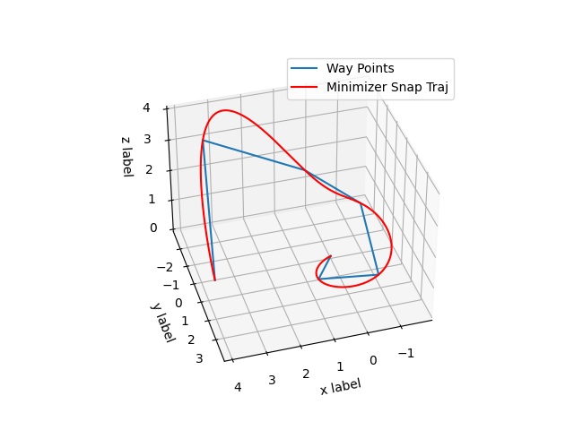

# Minimizer Snap Trajectory Generation:yum:

We have implemented two methods for solving the Minimizer Snap Trajectory Generation problem, including a close-form solution and an optimized solution based on OSQP. The result is as follows



## Build And Run Example:runner:

the following package is need to install

- [osqp](http://osqp.readthedocs.io/en/latest/index.html), needed for osqp-eigen
- [osqp-eigen](https://github.com/robotology/osqp-eigen), solve the QP problem
- [eigen](http://eigen.tuxfamily.org/index.php?title=Main_Page), matrix operation tool
- [matplotlib-cpp](https://github.com/lava/matplotlib-cpp), show the optimization result

then clone and build the project

```shell
git clone https://github.com/weihaoysgs/minimize-snap-traj-optimize.git
cd minimize-snap-traj-optimize
mkdir build
cmake ..
make -j12
```

run the example

```shell
./minimizer_snap_traj_generation
```

you will get the following result, which is a matrix with `k` rows and `3*poly_paramter_num` cols, the `k` is the trajectory segment number and the 3 meaning that the trajectory is in 3D space, `poly_parameter_num` is polynomial variable number. And the trajectory will also visualization via matplotlib.

```shell
 0          2.78854e-15 -9.90396e-16   3.3374e-16    0.0357055......
 1.20292    0.00672824    -0.279682   -0.0240655     0.016702......
-0.692698    -0.821328     0.128629    0.0548062  -0.00938771......
-0.979247     0.413536   0.00903509    -0.017289   0.00635208......
 0.366166     0.562193    0.0797064   0.00654287  -0.00444768......
 3.47916     0.411673    -0.133411 -0.000115826   0.00501725......
```

you can easy update the waypoint to generate deifferent smooth trajectory in the .cpp file

```cpp
Eigen::Matrix<double, 7, 3> waypoints;
// clang-format off
waypoints <<         0,         0,      0,
                1.20292,   3.05196,   1.32,
                -0.692698,   2.74029,   0.88,
                -0.979247, -0.258448,   1.46,
                0.366166,  -1.73207,      2,
                3.47916,  -1.59115,   3.62,
                3.78978,  0.978379,   0.56;
// clang-format on
```

## Acknowledgments:heart_eyes_cat:

Our implementation is based on professor Fei Gao’s code and theoretical explanation. Thanks to Teacher Gao and Fast-Lab for their open source contributions in motion planning field.
